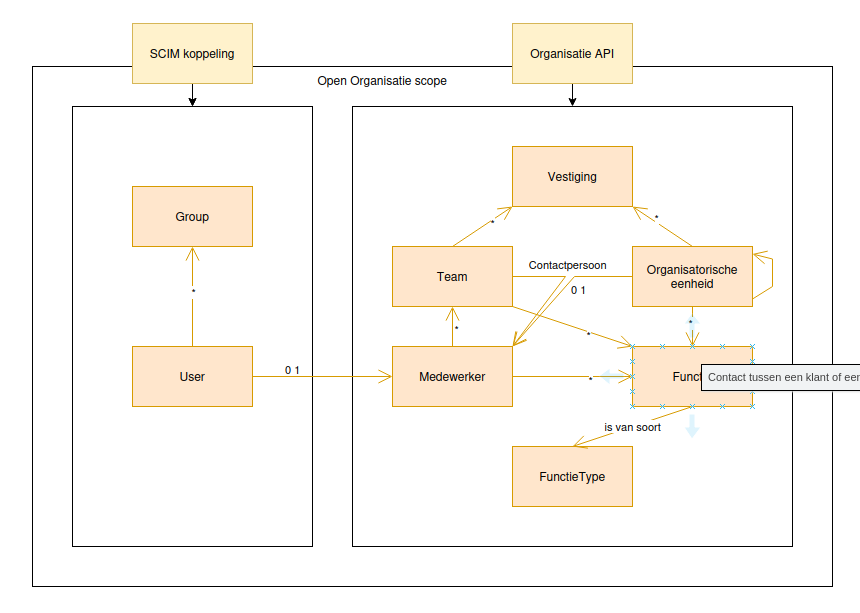

================
Open Organisatie
================

:Version: 0.1.0
:Source: https://github.com/maykinmedia/open-organisatie
:Keywords: ``organisation``

|docs| |docker|

A platform for municipalities to manage employees and teams.
(`Nederlandse versie`_)

Developed by `Maykin B.V.`_.

Introduction
============

Open Organisatie is an application for managing employees and teams.  
Other applications can integrate with Open Organisatie via a REST API to retrieve employee data  
or manage teams.  
Employee and team data is retrieved and synchronized via the SCIM protocol (System for Cross-domain Identity Management),  
from Azure Entra ID or other applications.

In Open Organisatie, employees and teams are stored. An employee contains data such as name, email address,  
job title, and contact information. A team is a group of employees who together form a specific role or department within the organisation.

Information model
=================

API specification
=================

Identity
--------

==============  ==============  =============================
API version     Release date   API specification
==============  ==============  =============================
latest          n/a             `ReDoc <https://redocly.github.io/redoc/?url=https://raw.githubusercontent.com/maykinmedia/open-organisatie/main/src/identiteit-openapi.yaml>`_,
                                `Swagger <https://petstore.swagger.io/?url=https://raw.githubusercontent.com/maykinmedia/open-organisatie/main/src/identiteit-openapi.yaml>`_,
                                (`diff <https://github.com/maykinmedia/open-organisatie/compare/0.1.0..main>`_)
0.1.0           2025-11-26      `ReDoc <https://redocly.github.io/redoc/?url=https://raw.githubusercontent.com/maykinmedia/open-organisatie/0.1.0/src/identiteit-openapi.yaml>`_,
                                `Swagger <https://petstore.swagger.io/?url=https://raw.githubusercontent.com/maykinmedia/open-organisatie/0.1.0/src/identiteit-openapi.yaml>`_
==============  ==============  =============================

Organisation
-----------

==============  ==============  =============================
API version     Release date   API specification
==============  ==============  =============================
latest          n/a             `ReDoc <https://redocly.github.io/redoc/?url=https://raw.githubusercontent.com/maykinmedia/open-organisatie/main/src/organisatie-openapi.yaml>`_,
                                `Swagger <https://petstore.swagger.io/?url=https://raw.githubusercontent.com/maykinmedia/open-organisatie/main/src/organisatie-openapi.yaml>`_,
                                (`diff <https://github.com/maykinmedia/open-organisatie/compare/0.1.0..main>`_)
0.1.0           2025-11-26      `ReDoc <https://redocly.github.io/redoc/?url=https://raw.githubusercontent.com/maykinmedia/open-organisatie/0.1.0/src/organisatie-openapi.yaml>`_,
                                `Swagger <https://petstore.swagger.io/?url=https://raw.githubusercontent.com/maykinmedia/open-organisatie/0.1.0/src/organisatie-openapi.yaml>`_
==============  ==============  =============================

Previous versions are supported for 6 month after the next version is released.

There is one way to authenticate with the API:

* An API token can be created in Open Organisation admin -> Tokens.

See: `All versions and changes <https://github.com/maykinmedia/open-organisatie/blob/main/CHANGELOG.rst>`_

Developers
==========

|build-status| |coverage| |ruff| |docker| |python-versions|

This repository contains the source code for openorganisatie. To quickly
get started, we recommend using the Docker image. You can also build the
project from the source code. For this, please look at 
`INSTALL.rst <INSTALL.rst>`_.

Quickstart
----------

1. Download and run openorganisatie:

   .. code:: bash

      wget https://raw.githubusercontent.com/maykinmedia/openorganisatie/main/docker-compose.yml
      docker-compose up -d --no-build
      docker-compose exec web src/manage.py loaddata demodata
      docker-compose exec web src/manage.py createsuperuser

2. In the browser, navigate to ``http://localhost:8000/`` to access the admin
   and the API.

References
==========

* `Documentation <https://open-organisatie.readthedocs.io/>`_
* `Docker image <https://hub.docker.com/r/maykinmedia/open-organisatie>`_
* `Issues <https://github.com/maykinmedia/open-organisatie/issues>`_
* `Code <https://github.com/maykinmedia/open-organisatie>`_

License
=======

Copyright © Maykin 2025

Licensed under the EUPL_

.. _`Nederlandse versie`: README.rst

.. _`Maykin B.V.`: https://www.maykinmedia.nl

.. _`EUPL`: LICENSE.md

.. |build-status| image:: https://github.com/maykinmedia/open-organisatie/actions/workflows/ci.yml/badge.svg?branch=main
    :alt: Build status
    :target: https://github.com/maykinmedia/open-organisatie/actions/workflows/ci.yml

.. |docs| image:: https://readthedocs.org/projects/open-organisatie/badge/?version=latest
    :target: https://open-organisatie.readthedocs.io/
    :alt: Documentation Status

.. |coverage| image:: https://codecov.io/github/maykinmedia/open-organisatie/branch/main/graphs/badge.svg?branch=main
    :alt: Coverage
    :target: https://codecov.io/gh/maykinmedia/open-organisatie

.. |ruff| image:: https://img.shields.io/endpoint?url=https://raw.githubusercontent.com/astral-sh/ruff/main/assets/badge/v2.json
    :target: https://github.com/astral-sh/ruff
    :alt: Ruff

.. |docker| image:: https://img.shields.io/docker/v/maykinmedia/open-organisatie?sort=semver
    :alt: Docker image
    :target: https://hub.docker.com/r/maykinmedia/open-organisatie

.. |python-versions| image:: https://img.shields.io/badge/python-3.12%2B-blue.svg
    :alt: Supported Python version

.. |oas| image:: https://github.com/maykinmedia/open-organisatie/actions/workflows/oas.yml/badge.svg
    :alt: OpenAPI specification checks
    :target: https://github.com/maykinmedia/open-organisatie/actions/workflows/oas.yml
